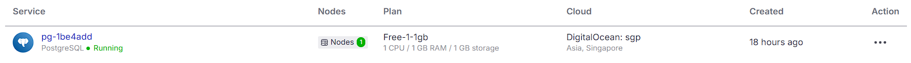
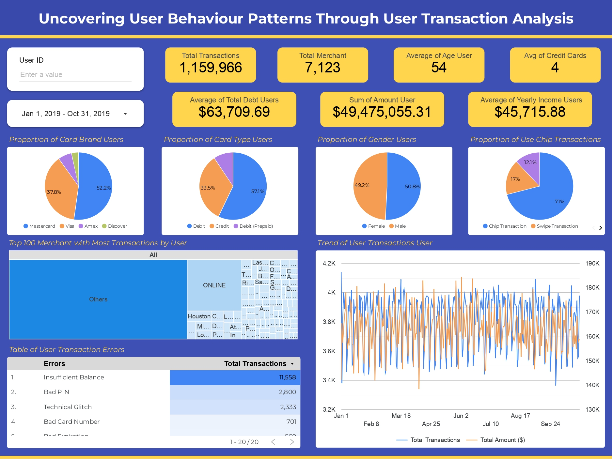

# User Transactions Analysis

## 1. Dataset
Diberikan tiga dataset terbuka untuk menganalisis kebiasaan pengguna. Ketiga dataset tersebut yaitu:
### *users_data.csv* 
berisi data-data pribadi pengguna. Data ini memiliki beberapa kolom seperti :
1. **id**: Primary key, identitas unik setiap pengguna.
2. **current_age**: Usia pengguna saat ini.
3. **retirement_age**: Usia pensiun yang diharapkan atau direncanakan oleh pengguna.
4. **birth_year**: Tahun lahir pengguna.
5. **birth_month**: Bulan lahir pengguna.
6. **gender**: Jenis kelamin pengguna (Male/Female).
7. **address**: Alamat tempat tinggal pengguna.
8. **latitude**: Koordinat lintang lokasi alamat pengguna.
9. **longitude**: Koordinat bujur lokasi alamat pengguna.
10. **per_capita_income**: Pendapatan per kapita di area tempat tinggal pengguna.
11. **yearly_income**: Pendapatan tahunan pengguna.
12. **total_debt**: Total utang yang dimiliki pengguna.
13. **credit_score**: Skor kredit pengguna, menunjukkan kelayakan kredit.
14. **num_credit_cards**: Jumlah kartu kredit yang dimiliki pengguna.

### *transactions_data.csv*
berisi data mengenai transaksi yang dilakukan oleh pengguna. Data ini memiliki beberapa kolom seperti :
1. **id**: Primary key, identitas unik setiap transaksi.
2. **date**: Tanggal dan waktu transaksi terjadi (format: YYYY-MM-DD HH:MM:SS).
3. **client_id**: ID pelanggan yang melakukan transaksi.
4. **card_id**: ID kartu yang digunakan dalam transaksi.
5. **amount**: Nilai nominal transaksi (dalam format string, misal: `$14.57`).
6. **use_chip**: Jenis transaksi berdasarkan penggunaan chip (misal: Swipe Transaction, Chip Transaction, Online Transaction).
7. **merchant_id**: ID merchant atau toko tempat transaksi dilakukan.
8. **merchant_city**: Kota merchant tempat transaksi berlangsung.
9. **merchant_state**: Negara bagian merchant tempat transaksi berlangsung.
10. **zip**: Kode pos lokasi merchant.
11. **mcc**: Merchant Category Code, kode kategori bisnis merchant.
12. **errors**: Kolom untuk mencatat error atau masalah pada transaksi (jika ada).

### *cards_data.csv*
berisi data kartu yang dimiliki oleh pengguna untuk melakukan transaksi. Data ini memiliki beberapa kolom seperti :
1. **id**: Primary key, identitas unik setiap kartu.
2. **client_id**: ID pelanggan yang memiliki kartu tersebut.
3. **card_brand**: Brand atau merek kartu (misal: Visa, Mastercard, Amex).
4. **card_type**: Jenis kartu (misal: Debit, Credit, Debit Prepaid).
5. **card_number**: Nomor unik pada kartu.
6. **expires**: Tanggal kadaluwarsa kartu (format: MM/YYYY).
7. **cvv**: Kode keamanan kartu (biasanya 3 atau 4 digit).
8. **has_chip**: Status apakah kartu memiliki chip (YES/NO).
9. **num_cards_issued**: Jumlah kartu yang diterbitkan untuk client tersebut.
10. **credit_limit**: Batas kredit yang diberikan pada kartu (hanya untuk kartu kredit).
11. **acct_open_date**: Tanggal pembukaan akun kartu.
12. **year_pin_last_changed**: Tahun terakhir PIN kartu diubah.
13. **card_on_dark_web**: Status apakah kartu pernah terdeteksi di dark web (Yes/No).

## 2. Pengolahan & Import Data
Sebelum data di import dan diolah melalui query SQL di Database ataupun melalui visualisasi di Looker Studio. Terdapat beberapa langkah yang dilakukan yaitu sebagai berikut:

### Pemotongan Data Transaksi
Data Transaksi awal memiliki lebih dari 13 juta row data yang mana sangat tidak memungkinkan bagi Saya yang tidak memiliki fasilitas GCP (berbayar) seperti BigQeury, Cloud Spanner, dan sebagainya untuk mengolah data tersebut di Looker Studio.

Oleh karena itu, Salah satu opsinya dengan menggunakan service cloud Database (dalam kasus ini saya menggunakan [Aiven](https://aiven.io) sebagai open source data platform). [Aiven](https://aiven.io) menyediakan service database cloud dengan kapasitas 1 GB. 

Untuk memudahkan Analisis dan kapabilitas service cloud Database tersebut. Saya melakukan pemotongan Data Transaksi menjadi beberapa data berdasarkan Tahun transaksinya, dilakukan dengan code python pada file [chunk_data_transactions_by_year.py](https://github.com). Data yang digunakan untuk di import dan dianalisis yaitu data pada tahun terakhir (2019).

### Proses Import Data ke Cloud DB 
Langkah-langkah dalam mengimport dataset kedalam cloud DB di Aiven yaitu sebagai berikut:
1. Buatlah Service dan pilih Service Typenya (Untuk project ini Saya menggunakan *PostgreSQL*)
2. Tentukan Version dari Postgresql, pilih *Free plan* untuk plan typenya.
3. Pilih plan gratis yang telah disediakan (Free-1-1gb), dan klik **Create Service**.

4. Setelah service berhasil di create. Klik halaman databases dan create database baru (misalkan db_user_transactions).
5. Buka alat manajemen basis data yang Anda gunakan (pgadmin, dbeaver, dll) dan connect db sesuai dengan connection information yang dapat dilihat di overview service. Untuk nama database ganti menjadi nama database yang baru saja dibuat. Setelah semua informasi telah diisi lalu connect.

## 3. Query SQL
Terdapat 2 script query SQL yaitu:

### Query untuk Update Column

### Query untuk Eksplorasi Data

## 4. Link Looker Studio

[Link Dashboard](https://lookerstudio.google.com/reporting/80ea4855-2881-4657-a7fe-9a4ec0073c54) 

### Catatan
- Data blend pada looker studio hanya dapat menampung 150000 row data sehingga data transactions yang ditampilkan pada looker studio bukan dari data transactions yang diblend dengan data lain (cards dan users)
